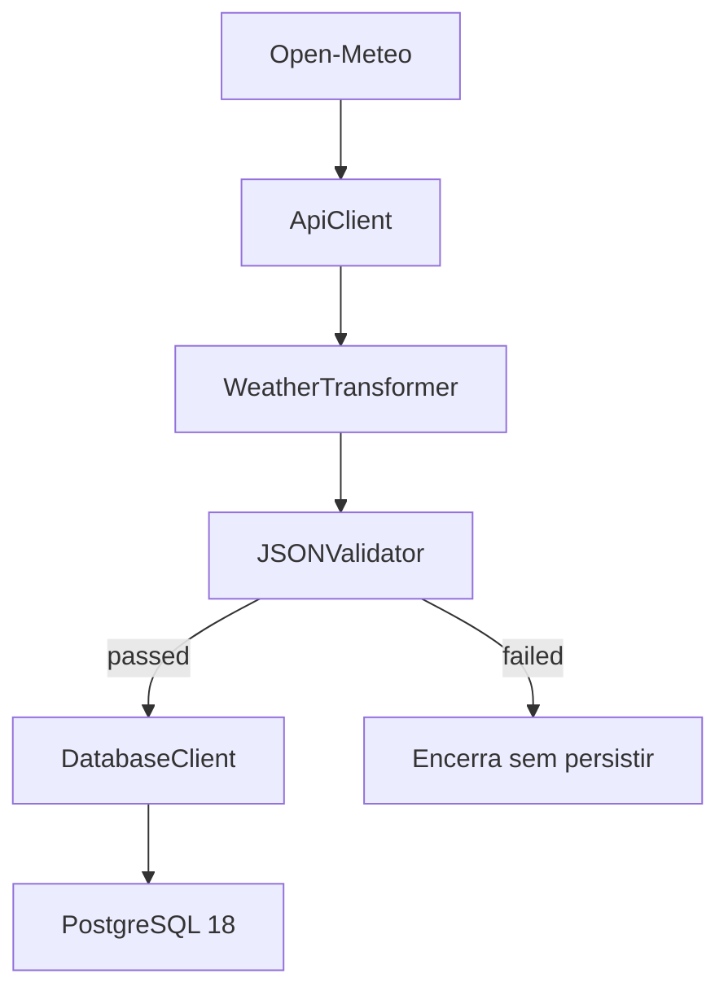
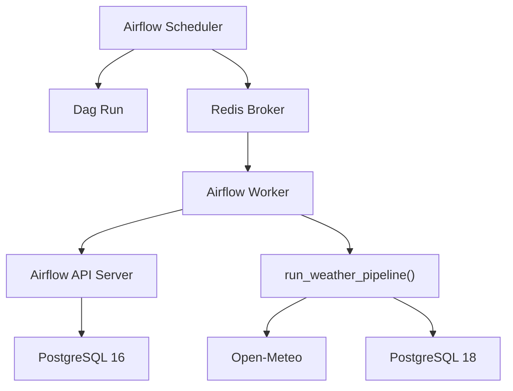

# Weather Data Pipeline

[](https://github.com/kaykyduarte/weather-data-pipeline/actions/workflows/ci.yml)

Pipeline em Python para coletar previsoes horarias da Open-Meteo, transformar a resposta em registros estruturados, validar qualidade dos dados e persistir o resultado em PostgreSQL com `UPSERT` idempotente. O projeto tambem possui automacao com Airflow usando `CeleryExecutor` e `Redis`.

## Tecnologias

- Python 3.13
- Requests
- Apache Airflow 3.3
- CeleryExecutor
- Redis
- PostgreSQL 18
- PostgreSQL 16
- psycopg
- Docker / Docker Compose
- pytest
- Ruff
- GitHub Actions

## Problema que o projeto resolve

APIs meteorologicas normalmente devolvem respostas orientadas a series, com listas paralelas como:

- `time`
- `temperature_2m`
- `relative_humidity_2m`
- `precipitation`
- `wind_speed_10m`

Esse formato e bom para transporte, mas ruim para:

- validar regras de qualidade por registro
- persistir em banco relacional
- reprocessar sem duplicar linhas
- detectar degradacoes de rede em execucoes automatizadas

Este projeto resolve isso com uma pipeline que:

1. consulta a Open-Meteo
2. transforma a resposta em registros horarios
3. aplica um Data Quality Gate
4. grava em PostgreSQL com `UPSERT`
5. evita duplicidade pela chave `latitude + longitude + forecast_at`

## Pre-requisitos

Para executar o projeto localmente, o ambiente esperado e:

- Python 3.13
- Docker
- Docker Compose

O projeto nao exige instalacao local do PostgreSQL no sistema host. O banco de dados da aplicacao e fornecido pelo `compose.yaml`, usando PostgreSQL 18 em container.

## Arquitetura

O projeto e dividido em componentes pequenos e especializados:

- `ApiClient`: camada HTTP com retry, backoff exponencial, mensagens de erro de dominio e logs de retry
- `WeatherTransformer`: converte a resposta da Open-Meteo em registros estruturados
- `JSONValidator`: aplica o Data Quality Gate sobre os registros transformados
- `DatabaseClient`: testa conexao e executa `UPSERT` em lote
- `WeatherPipeline`: orquestra API, transformacao, validacao e persistencia
- `main.py`: ponto de entrada, observabilidade e exit codes
- `Airflow Scheduler`: cria e coordena `Dag Runs`
- `Redis`: atua como broker do `CeleryExecutor`
- `Airflow Worker`: executa `run_weather_pipeline()`
- `PostgreSQL 16`: armazena os metadados do Airflow
- `PostgreSQL 18`: armazena os dados meteorologicos
- `airflow/Dockerfile`: cria a imagem customizada com o codigo da aplicacao

### Pipeline de dados



### Orquestracao



## Fluxo API -> transformacao -> validacao -> PostgreSQL

### 1. Coleta da API

O `ApiClient` consulta `https://api.open-meteo.com/v1/forecast` com:

- latitude e longitude
- timezone
- variaveis horarias
- um dia de previsao

### 2. Transformacao

O `WeatherTransformer`:

- valida a estrutura raiz da resposta
- valida `latitude`, `longitude`, `timezone` e `hourly`
- valida a existencia e o tamanho das series obrigatorias
- converte `time` local para `datetime` UTC em `forecast_at`
- gera uma lista de registros com:

```text
forecast_at
latitude
longitude
temperature_c
relative_humidity_pct
precipitation_mm
wind_speed_kmh
```

### 3. Validacao

O `JSONValidator` valida o schema esperado do registro transformado e produz um relatorio com:

- `passed`
- `total_records`
- `invalid_records`
- `issues`

### 4. Persistencia

O `DatabaseClient` persiste os registros usando `UPSERT` em lote sobre a tabela `weather_forecasts`.

## Retry + exponential backoff

O `ApiClient` implementa retry com:

- `timeout`
- `max_retries`
- `backoff_seconds`

O numero total de tentativas e:

```text
max_retries + 1
```

O atraso entre tentativas usa backoff exponencial:

```text
delay = backoff_seconds * (2 ** (attempt - 1))
```

Exemplo com `backoff_seconds=0.5` e `max_retries=2`:

- tentativa 1 falha -> espera `0.5`
- tentativa 2 falha -> espera `1.0`
- tentativa 3 falha -> retries esgotados, erro final

### Politica de retry

O cliente repete tentativas em falhas transitorias, incluindo:

- `Timeout`
- `ConnectionError`
- `HTTP 500`
- `HTTP 502`
- `HTTP 503`
- `HTTP 504`

Erros nao transitorios, como `HTTP 404`, falham imediatamente.

### Observabilidade do retry

Cada retry gera um `WARNING` estruturado, por exemplo:

```text
api_retry endpoint=/v1/forecast reason=Timeout next_attempt=2 total_attempts=3 delay_seconds=0.500
```

Isso ajuda a detectar instabilidade mesmo quando a chamada final termina com sucesso.

## Idempotencia / UPSERT

O banco usa uma restricao unica composta em:

- `latitude`
- `longitude`
- `forecast_at`

Com isso, a operacao e idempotente:

- se a chave nao existe, insere
- se a chave ja existe, atualiza apenas as medidas

Campos atualizados no conflito:

- `temperature_c`
- `relative_humidity_pct`
- `precipitation_mm`
- `wind_speed_kmh`
- `ingested_at`

Campos que nao sao atualizados:

- `id`
- `latitude`
- `longitude`
- `forecast_at`

## Data Quality Gate

O `JSONValidator` funciona como gate de qualidade antes da persistencia.

Se a validacao falhar:

- a pipeline nao chama o banco
- `pipeline_passed=False`
- `persisted_records=0`

Categorias suportadas no relatorio:

- `empty_batch`
- `missing_field`
- `null_value`
- `invalid_type`

Exemplos de validacao:

- lote vazio reprova
- campo ausente reprova
- valor `None` reprova
- `bool` onde o contrato espera `int` reprova

## PostgreSQL e migrations

A migration inicial do projeto esta em:

```text
sql/001_create_weather_forecasts.sql
```

Ela cria a tabela `weather_forecasts` com:

- chave primaria
- unicidade composta
- `ingested_at` com valor padrao
- constraints de dominio

Exemplos de protecao de dominio no banco:

- umidade entre `0` e `100`
- precipitacao nao negativa
- vento nao negativo

### Observacao importante sobre a migration em Docker

No Docker Compose, o script SQL e montado em:

```text
/docker-entrypoint-initdb.d/
```

Isso significa que ele e relevante para a inicializacao de um banco novo.

Em outras palavras:

- funciona bem para bootstrap inicial do banco
- nao substitui uma estrategia real de versionamento de schema em bancos ja persistidos

Para evolucoes futuras de schema, o caminho natural seria adotar uma estrategia de migrations versionadas, por exemplo:

- `001_create_...`
- `002_add_...`
- `003_alter_...`

ou ferramentas dedicadas como Alembic ou Flyway.

## Docker e Docker Compose

### Dockerfile

O projeto possui um `Dockerfile` para construir a aplicacao com:

- `python:3.13-slim`
- logs sem buffer
- sem geracao de `.pyc`
- codigo copiado apenas de `src/`
- usuario nao-root para execucao

### Compose da aplicacao

O `compose.yaml` define:

- `postgres`
- `weather_pipeline`

O servico `postgres` inclui:

- imagem `postgres:18`
- healthcheck com `pg_isready`
- migration montada como somente leitura
- volume persistente

O servico `weather_pipeline`:

- constroi a imagem localmente
- recebe variaveis do `.env`
- sobrescreve `POSTGRES_HOST=postgres`
- depende do banco com `service_healthy`

### Compose do Airflow

O `airflow/docker-compose.yaml` define a camada de orquestracao com:

- `postgres:16` para os metadados do Airflow
- `redis` como broker do Celery
- `airflow-scheduler`
- `airflow-worker`
- `airflow-dag-processor`
- `airflow-apiserver`
- `airflow-triggerer`
- imagem customizada via `airflow/Dockerfile`

## Estrutura do projeto

```text
weather-data-pipeline/
|-- .github/
|   `-- workflows/
|       `-- ci.yml
|-- .env.example
|-- airflow/
|   |-- .env.example
|   |-- dags/
|   |   `-- weather_pipeline.py
|   |-- Dockerfile
|   `-- docker-compose.yaml
|-- sql/
|   `-- 001_create_weather_forecasts.sql
|-- src/
|   |-- api_client.py
|   |-- config.py
|   |-- database.py
|   |-- json_validator.py
|   |-- main.py
|   |-- pipeline.py
|   `-- transformer.py
|-- tests/
|   |-- integration/
|   |   `-- test_database_integration.py
|   |-- test_api_client.py
|   |-- test_config.py
|   |-- test_database.py
|   |-- test_json_validator.py
|   |-- test_main.py
|   |-- test_pipeline.py
|   `-- test_transformer.py
|-- compose.yaml
|-- Dockerfile
|-- pyproject.toml
|-- pytest.ini
|-- requirements-dev.txt
`-- requirements.txt
```

## Testes

O projeto possui:

- testes unitarios com `pytest`
- testes de integracao reais com PostgreSQL

Cobertura principal:

- `ApiClient`
  - sucesso
  - timeout
  - falha de conexao
  - `HTTPError`
  - JSON invalido
  - retry e backoff
  - logs de retry
- `ApiConfig` e `DatabaseConfig`
  - parsing
  - variaveis ausentes
  - intervalos invalidos
- `WeatherTransformer`
  - happy path
  - timezone invalido
  - data invalida
  - tamanhos inconsistentes
- `JSONValidator`
  - lote valido
  - lote vazio
  - campo ausente
  - valor `None`
  - tipo invalido
- `WeatherPipeline`
  - caminho de sucesso
  - quality gate reprovado
  - contrato da resposta raiz
- `DatabaseClient`
  - conexao
  - `SELECT 1`
  - `UPSERT`
  - erro de escrita
  - idempotencia real
  - rollback real

### Rodar testes unitarios

```bash
python -m pytest -m "not integration"
```

### Rodar testes de integracao

```bash
python -m pytest -m integration
```

## Continuous Integration (CI)

O workflow em `.github/workflows/ci.yml` possui quatro jobs:

### `test`

- checkout
- Python 3.13
- instalacao de `requirements-dev.txt`
- `ruff check src tests`
- `ruff format --check src tests`
- `python -m pytest -m "not integration"`

### `integration`

- depende de `test`
- sobe PostgreSQL 18 como service container
- aplica a migration
- roda `python -m pytest -m integration`

### `airflow-validate`

- depende de `test`
- constroi a imagem de `airflow/Dockerfile`
- monta `airflow/dags` em container somente leitura
- valida importacoes com `DagBag`
- confirma que a DAG `weather_data_pipeline` foi carregada

### `docker-build`

- depende de `integration`
- depende de `airflow-validate`
- constroi a imagem local do projeto
- usa a tag `weather-pipeline:ci`

## Como executar

### 1. Criar e ativar ambiente virtual

PowerShell:

```powershell
python -m venv .venv
.\.venv\Scripts\Activate.ps1
```

### 2. Instalar dependencias

```bash
python -m pip install -r requirements-dev.txt
```

### 3. Configurar ambiente

Crie seu `.env` a partir de `.env.example`.

### 4. Rodar a aplicacao localmente

```bash
python -m src.main
```

### 5. Rodar com Docker Compose

Subir apenas o PostgreSQL:

```bash
docker compose up -d postgres
```

Subir a aplicacao e o banco:

```bash
docker compose up --build
```

Rodar a pipeline como execucao pontual:

```bash
docker compose run --rm weather_pipeline
```

## Executar com Airflow

### 1. Criar os arquivos locais

```powershell
Copy-Item .env.example .env
Copy-Item airflow/.env.example airflow/.env
```

### 2. Gerar uma Fernet Key

```bash
docker run --rm apache/airflow:3.3.0 python -c "from cryptography.fernet import Fernet; print(Fernet.generate_key().decode())"
```

### 3. Gerar o segredo JWT

```bash
python -c "import secrets; print(secrets.token_hex(32))"
```

Os valores gerados nesses dois passos devem substituir os placeholders correspondentes em `airflow/.env`.

### 4. Criar o banco meteorologico e a rede compartilhada

```bash
docker compose up -d postgres
```

### 5. Inicializar o Airflow

```powershell
docker compose --env-file .\airflow\.env -f .\airflow\docker-compose.yaml up --build airflow-init
```

### 6. Subir os servicos

```powershell
docker compose --env-file .\airflow\.env -f .\airflow\docker-compose.yaml up -d
```

### 7. Acessar a interface

Acesse [http://localhost:8080](http://localhost:8080) e ative a DAG `weather_data_pipeline`.

O usuario e a senha da interface sao definidos por:

- `_AIRFLOW_WWW_USER_USERNAME`
- `_AIRFLOW_WWW_USER_PASSWORD`

### Comportamento da DAG

| Configuracao | Valor |
| --- | --- |
| Agendamento | `0 * * * *` - a cada hora |
| Catchup | Desativado |
| Dag Runs simultaneas | 1 |
| Retries | 2, alem da tentativa inicial |
| Timeout por tentativa | 5 minutos |
| Timeout da Dag Run | 20 minutos |

## Variaveis de ambiente

O projeto utiliza dois arquivos locais de ambiente:

- `.env`: configuracao da aplicacao e do PostgreSQL meteorologico
- `airflow/.env`: configuracao e credenciais locais do Airflow

Os arquivos `.env.example` e `airflow/.env.example` funcionam como templates versionados, sem segredos reais.

### Banco da aplicacao

```env
POSTGRES_HOST=localhost
POSTGRES_PORT=5432
POSTGRES_DB=weather_db
POSTGRES_USER=weather_user
POSTGRES_PASSWORD=your_postgres_password_here
```

### API

```env
API_BASE_URL=https://api.open-meteo.com
API_TIMEOUT=10
API_MAX_RETRIES=2
API_BACKOFF_SECONDS=0.5
```

### Airflow

```env
AIRFLOW_IMAGE_NAME=weather-airflow:3.3.0
AIRFLOW_UID=50000
FERNET_KEY=replace_with_generated_fernet_key
AIRFLOW__API_AUTH__JWT_SECRET=replace_with_random_jwt_secret
AIRFLOW__API_AUTH__JWT_ISSUER=airflow
_AIRFLOW_WWW_USER_USERNAME=airflow
_AIRFLOW_WWW_USER_PASSWORD=change_me
```

## Decisoes arquiteturais

### 1. Configuracoes separadas por dominio

O projeto usa:

- `DatabaseConfig`
- `ApiConfig`

Isso evita misturar infraestrutura de banco com politica HTTP.

### 2. Context managers aninhados mantidos

O projeto ignora apenas `SIM117` no Ruff para preservar `with` aninhados quando isso deixa ownership e fluxo de excecoes mais claros.

### 3. Erros de dominio explicitos

O projeto converte erros tecnicos em excecoes de dominio, por exemplo:

- `ApiClientError`
- `WeatherTransformError`
- `DatabaseConnectionError`
- `DatabaseWriteError`
- `PipelineError`
- `ConfigError`

### 4. Pipeline falha de forma semantica

Exit codes no `main.py`:

- `0`: sucesso
- `1`: falha tecnica
- `2`: quality gate reprovado

### 5. Validacao antes da persistencia

O banco nao e chamado se os dados nao passam no `JSONValidator`.

### 6. Persistencia idempotente

O uso de `UPSERT` com chave unica composta evita duplicidade e permite reprocessamento seguro.

### 7. Automacao desacoplada da aplicacao

O Airflow orquestra a execucao, mas a logica principal continua concentrada em `run_weather_pipeline()`. Isso permite reuso local, via Docker ou por task do Airflow sem duplicar regra de negocio.

## Limitacoes atuais

- Os parametros meteorologicos e a localizacao consultada ainda sao definidos pela aplicacao. Ainda nao existe uma camada externa para cadastro dinamico de cidades, coordenadas ou colecoes de consultas.
- A stack do Airflow foi projetada para desenvolvimento local e nao representa uma configuracao de producao.
- A migration atual atende muito bem ao bootstrap de um banco novo, mas nao representa ainda uma estrategia completa de evolucao de schema para ambientes persistidos.
- O CI foi desenhado deliberadamente para nao depender da Open-Meteo real em testes end-to-end. Isso deixa o pipeline de validacao mais estavel e previsivel, mas tambem significa que a integracao com a API externa nao e validada em cada execucao do GitHub Actions.
- `executemany()` e adequado para os pequenos lotes atuais, especialmente as 24 linhas horarias. Para volumes muito maiores, essa provavelmente nao seria a estrategia final de carga.
